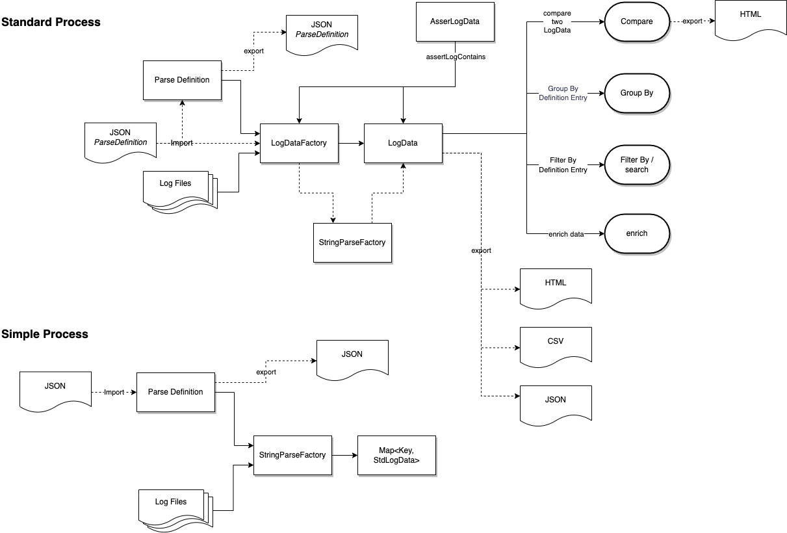
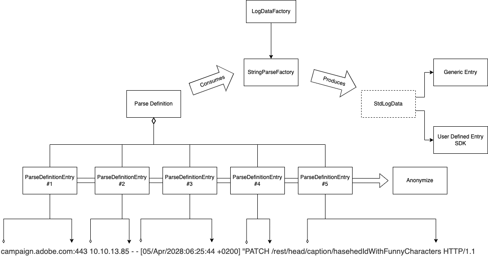
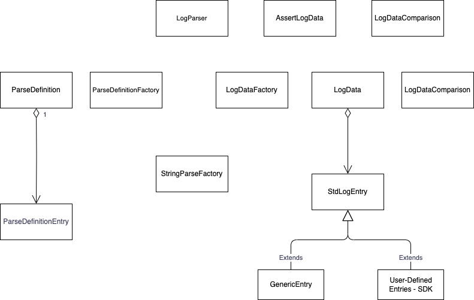

# log-parser
[](https://github.com/adobe/log-parser/actions/workflows/onPushSimpleTest.yml) 
[](https://codecov.io/gh/adobe/log-parser)
[](https://javadoc.io/doc/com.adobe.campaign.tests/log-parser)
[](https://sonarcloud.io/summary/new_code?id=adobe_log-parser) 

The log parser is designed to help include log results in tests, reports and general applicative processes. It allows you to parse and analyze log files in order to extract relevant data. It can be used as is or as an SDK, where you can define your own parsing.

The basic method for using this library is, that you create a definition for your parsing. This definition allows you to parse a set of log files and extract all entries that match this pattern.



## Table of contents
<!-- TOC -->
* [log-parser](#log-parser)
  * [Table of contents](#table-of-contents)
  * [Installation](#installation)
    * [Maven](#maven)
  * [Running the Log Parser](#running-the-log-parser)
  * [Parse Definitions](#parse-definitions)
    * [Defining a Parsing](#defining-a-parsing)
    * [Defining an entry](#defining-an-entry)
    * [How parsing works](#how-parsing-works)
      * [Anonymizing Data](#anonymizing-data)
    * [Code Example](#code-example)
    * [Import and Export of Parse Definitions](#import-and-export-of-parse-definitions)
    * [Importing a JSON File](#importing-a-json-file)
  * [Extracting Data from Logs](#extracting-data-from-logs)
    * [Using the Standard Method](#using-the-standard-method)
    * [Using the Log-Parser as an SDK](#using-the-log-parser-as-an-sdk)
      * [Writing your own SDK](#writing-your-own-sdk)
        * [Declaring a Default and Copy Constructor](#declaring-a-default-and-copy-constructor)
        * [Declaring the transformation Rules in setValuesFromMap](#declaring-the-transformation-rules-in-setvaluesfrommap)
        * [Declaring the Key](#declaring-the-key)
        * [Declare the HeaderMap, and ValueMap](#declare-the-headermap-and-valuemap)
  * [Code Structure](#code-structure)
  * [Searching and organizing log data](#searching-and-organizing-log-data)
    * [Search and Filter Mechanisms](#search-and-filter-mechanisms)
      * [Defining a Search Term](#defining-a-search-term)
    * [Enriching Log Data](#enriching-log-data)
    * [GroupBy Mechanisms](#groupby-mechanisms)
      * [Passing a list](#passing-a-list)
      * [Chaining GroupBy](#chaining-groupby)
    * [Comparing Log Data](#comparing-log-data)
      * [Creating a Differentiation Report](#creating-a-differentiation-report)
  * [Assertions and LogDataAssertions](#assertions-and-logdataassertions)
  * [Exporting Parse Results](#exporting-parse-results)
    * [Exporting Results to a CSV File](#exporting-results-to-a-csv-file)
    * [Exporting Results to an HTML File](#exporting-results-to-an-html-file)
  * [Command-line Execution of the Log-Parser](#command-line-execution-of-the-log-parser)
  * [Changelog](#changelog)
    * [1.11.0 (next version)](#1110--next-version-)
    * [1.0.10](#1010)
    * [1.0.8.2](#1082)
    * [1.0.8](#108)
    * [1.0.7](#107)
    * [1.0.6](#106)
    * [1.0.5](#105)
    * [1.0.4](#104)
    * [1.0.3](#103)
    * [1.0.1](#101)
<!-- TOC -->

## Installation
For now, we are using this library with maven, in later iteration we will publish other build system examples:

### Maven
The following dependency needs to be added to your pom file:

```
 <dependency>
    <groupId>com.adobe.campaign.tests</groupId>
    <artifactId>log-parser</artifactId>
    <version>1.0.10</version>
</dependency>
```
## Running the Log Parser
We have two ways of running the log parser:
1. Programmatically, as a library and in your test you can simply use the log-parser to analyse your log files.
2. Command-Line, as of version 1.11.0, we allow you to run your log-parsing from the command-line. Further details can be found in the section [Command-line Execution of the Log-Parser](#command-line-execution-of-the-log-parser).

## Parse Definitions
In order to parse logs you need to define a ParseDefinition. A ParseDefinition contains a set of ordered ParseDefinition Entries. While parsing a line of logs, the LogParser will see if all entries can be found in the line of logs. If that is the case, the line is stored according to the definitions.

### Defining a Parsing
Each Parse Definition consists of :
- Title
- A set of entries
- A Padding allowing us to create a legible key
- A key Order which is used for defining the Key
- If you want the result to include the log file name and path

### Defining an entry
Each entry for a Parse Definition allows us to define:
- A title for the value which will be found.
- The start pattern of the string that will contain the value (null if in the start of a line)
- The end pattern of the string that will contain the value (null if in the end of a line)
- Case Sensitive search
- Is to be kept. In some cases we just need to find a line with certain particularities, but we don't actually want to store the value.
- Anonymizers, we can provide a set of anonymizers so that some values are skipped when parsing a line.

### How parsing works
When you have defined your parsing you use the LogDataFactory by passing it:
1. The log files it should parse
2. The ParseDefinition

By using the StringParseFactory we get a LogData object with allows us to manage the logs data you have found.



#### Anonymizing Data
We have discovered that it would be useful to anonymize data. This will aloow you to group some log data that contains variables. Anonymization has two features:
* Replacing Data using `{}`,
* Ignoring Data using `[]`.

For example if you store an anonymizer with the value:
```
Storing key '{}' in the system

```

the log-parser will merge all lines that contain the same text, but with different values for the key. For example:
* Storing key 'F' in the system
* Storing key 'B' in the system
* Storing key 'G' in the system

will all be stored as `Storing key '{}' in the system`. 

Sometimes we just want to anonymize part of a line. This is useful if you want to do post-treatment. For example in our previous example as explained `Storing key 'G' in the system`, would be merged, however `NEO-1234 : Storing key 'G' in the system` would not be merged. In this cas we can do a partial anonymization using the `[]` notation. For example if we enrich our original template:
```
[]Storing key '{}' in the system
```

In this case the lines:
* `NEO-1234 : Storing key 'G' in the system` will be stored as `NEO-1234 : Storing key '{}' in the system`
* `NEO-1234 : Storing key 'H' in the system` will be stored as `NEO-1234 : Storing key '{}' in the system`
* `EXA-1234 : Storing key 'Z' in the system` will be stored as `EXA-1234 : Storing key '{}' in the system`
* `EXA-1234 : Storing key 'X' in the system` will be stored as `EXA-1234 : Storing key '{}' in the system`


### Code Example
Here is an example of how we can parse a string. The method is leveraged to perform the same parsing in one or many files.

```java
@Test
public void parseAStringDemo() throws StringParseException {
    String logString = "afthostXX.qa.campaign.adobe.com:443 - - [02/Apr/2022:08:08:28 +0200] \"GET /rest/head/workflow/WKF193 HTTP/1.1\" 200 ";

    //Create a parse definition
    ParseDefinitionEntry verbDefinition = new ParseDefinitionEntry();
    verbDefinition.setTitle("verb");
    verbDefinition.setStart("\"");
    verbDefinition.setEnd(" /");

    ParseDefinitionEntry apiDefinition = new ParseDefinitionEntry();
    apiDefinition.setTitle("path");
    apiDefinition.setStart(" /");
    apiDefinition.setEnd(" ");

    List<ParseDefinitionEntry> definitionList = Arrays.asList(verbDefinition,apiDefinition);

    //Perform Parsing
    Map<String, String> parseResult = StringParseFactory.parseString(logString, definitionList);

    //Check Results
    assertThat("We should have an entry for verb", parseResult.containsKey("verb"));
    assertThat("We should have the correct value for logDate", parseResult.get("verb"), is(equalTo("GET")));

    assertThat("We should have an entry for the API", parseResult.containsKey("path"));
    assertThat("We should have the correct value for logDate", parseResult.get("path"),
            is(equalTo("rest/head/workflow/WKF193")));
}
```
In the code above we want to parse the log line below, and want to fin the REST call "GET /rest/head/workflow/WKF193", and to extract the verb "GET", and the api "/rest/head/workflow/WKF193". 
`afthostXX.qa.campaign.adobe.com:443 - - [02/Apr/2022:08:08:28 +0200] \"GET /rest/head/workflow/WKF193 HTTP/1.1\" 200`

The code starts with the creation a parse definition with at least two parse definitions that tell us between which markers should each data be extracted. The parse difinition is then handed to the StringParseFactory so that the data can be extracted.
At the end we can see that each data is stored in a map with the parse defnition entry title as a key.

### Import and Export of Parse Definitions
You can import or store a Parse Definition to or from a JSON file.

### Importing a JSON File
You can define a Parse Definition in a JSON file. 

This can then be imported and used for parsing using the method `ParseDefinitionFactory.importParseDefinition`. Here is small example of how the JSON would look like:

```JSON
{
  "title": "Anonymization",
  "storeFileName": false,
  "storeFilePath": false,
  "storePathFrom": "",
  "keyPadding": "#",
  "keyOrder": [],
  "definitionEntries": [
    {
      "title": "path",
      "start": "HTTP/1.1|",
      "end": "|Content-Length",
      "caseSensitive": false,
      "trimQuotes": false,
      "toPreserve": true,
      "anonymizers": [
        "X-Security-Token:{}|SOAPAction:[]"
      ]
    }
  ]
}
```

## Extracting Data from Logs
By default, the Log-Parser will generate a standardized key-value extraction of the log you generate. All values are then stored as Strings. For more advanced transformations we suggest you write your own Log SDK. We will describe each in detail in this chapter.

### Using the Standard Method
By default, each entry for your lag parsing will be stored as a Generic entry. This means that all values will be stored as Strings. Each entry will have a :
- Key
- A set of values
- The frequency of the key as found in the logs

### Using the Log-Parser as an SDK
Using the log parser as an SDK allow you to define your own transformations and also to override many of the behaviors. By fefault we can look at the SDK mode as a second parsing, where we first parse the logs using the generic ParseDefinitions, and then a second treatment is performed with the SDK you write.

Typical use cases are:
* Transformation of parts of the parsed log data into non-string types.
* Additional parsing of the parsed data.

#### Writing your own SDK
In order to use this feature you need to define a class that extends the class StdLogEntry.

You will often want to transform the parsed information into a more manageable object by defining your own fields in the SDK class.

In the project we have two examples of SDKs (under `src/test/java``:
* `com.adobe.campaign.tests.logparser.data.SDKCaseSTD` where we perform additional parsing of the log data.
* `com.adobe.campaign.tests.logparser.data.SDKCase2` where we transform the time into a date object.

##### Declaring a Default and Copy Constructor
You will need to declare a default constructor and a copy constructor. The copy constructor will allow you to copy the values from one object to another.

##### Declaring the transformation Rules in setValuesFromMap
You will need to declare how the parsed variables are transformed into your SDL. This is done in the method `setValuesFromMap()`.

In there you can define a fine-grained extraction of the variables. This could be extracting hidden data in strings of the extracted data, or simple data transformations such as integer or dates.

##### Declaring the Key
You will need to define how a unique line will look like. Although this is already done in the Definition Rules, you may want to provide more precisions. This is doen in the method `makeKey()`.

##### Declare the HeaderMap, and ValueMap
Depending on the fields you have defined, you will want to define how the results are represented when they are stored in your system.

You will need to give names to the headers, and provide a map that extracts the values.


## Code Structure
Below is a diagram representing the class structure:



## Searching and organizing log data
We have a series of search and organizing the log data. These by general use Hamcrest Matchers to allow you to define different querires. 

### Search and Filter Mechanisms
We have introduced the filter and search mechanisms. These allow you to search the LogData for values for a given ParseDefinitionEntry. For this we have introduced the following methods:
* isElementPresent
* searchEntries
* filterBy

We currently have the following signatures:

```java
public boolean isEntryPresent(String in_parseDefinitionName, String in_searchValue)
public boolean isEntryPresent(Map<String, Matcher> in_searchKeyValues)
public LogData<T> searchEntries(String in_parseDefinitionName, String in_searchValue)
public LogData<T> searchEntries(Map<String, Matcher> in_searchKeyValues)
public LogData<T> filterBy(Map<String, Matcher> in_filterKeyValues)
```

#### Defining a Search Term
When we define a search term, we do this by defining it as a map of ParseDefining Entry Name and a Matcher. The Matcher we use is a Hamcrest matcher which provides great flexibility in defining the search terms.

```java
Map<String, Matcher> l_filterProperties = new HashMap<>();
        l_filterProperties.put("Definition 1", Matchers.equalTo("14"));
        l_filterProperties.put("Definition 2", Matchers.startsWith("13"));

LogData<GenericEntry> l_foundEntries = l_logData.searchEntries(l_filterProperties)); 
```

In versions prior to 1.11.0 we used a map of key and Objects for search terms. In these queries it was implicitly an equality check. Because of that these search terms can be replaced with `Matchers.equalTo` or `Matchers.is`.

Example of a search term in version 1.10.0:
```java
Map<String, Object> l_filterProperties = new HashMap<>();
l_filterProperties.put("Definition 1", "14");
```

In version 1.11.0 the same search term would look like this:
```java
Map<String, Matcher> l_filterProperties = new HashMap<>();
l_filterProperties.put("Definition 1", Matchers.equalTo("14"));
```

### Enriching Log Data
We have the capability to enrich log data with additional information. This is done by using the method `LogData#enrichData(Map<String, Matcher>, String, String)`. This method accepts:
* A search term (as defined in the section [Defining a Search Term](#defining-a-search-term))
* The title of the entry to be added
* The value for the new entry in the search lines

Enrichment can be done multiple times in order to add multiple values for the enrichment.

We have also introduced a method called `LogData#enrichEmpty(String, String)`, which sets a value for the entries which have not yet have a value set for them.  

### GroupBy Mechanisms
We have introduced the groupBy mechanism. This functionality allows you to organize your results with more detail. Given a log data object, and an array of ParseDefinitionEntry names, we generate a new LogData Object containing groups made by the passed ParseDeinitionEnries and and number of entries for each group.

Let's take the following case:

Definition 1 | Definition 2 | Definition 3 | Definition 4
------------ | ------------ | ------------ | ------------
12 | 14 | 13 | AA
112 | 114 | 113 | AAA
120 | 14 | 13 | AA


If we perform groupBy with the parseDefinition `Definition 2`, we will be getting a new LogData object with two entries:

Definition 2 | Frequence
------------ | ------------
14 | 2
114 | 1

We can also pass a list of group by items, or even perform a chaining of the group by predicates.

#### Passing a list
We can create a sub group of the LogData by creating group by function:

```java
LogData<GenericEntry> l_myGroupedData = logData.groupBy(Arrays.asList("Definition 1", "Definition 4"));

//or 

LogData<MyImplementationOfStdLogEntry> l_myGroupedData = logData.groupBy(Arrays.asList("Definition 1", "Definition 4"), MyImplementationOfStdLogEntry.class);
```

In this case we get :

| Definition 1 | Definition 4 | Frequence |
|--------------|--------------|-----------|
| 12           | AA           | 1         |
| 112          | AAA          | 1         |
| 120          | AA           | 1         |


#### Chaining GroupBy
The GroupBy can also be chained. Example:

```java
LogData<GenericEntry> l_myGroupedData = logData.groupBy(Arrays.asList("Definition 1", "Definition 4")).groupBy("Definition 4");
```

In this case we get :

| Definition 4 | Frequence |
| ------------ |-----------|
| AA          | 2         |
| AAA         | 1         |

### Comparing Log Data
As of version 1.11.0 we have introduced the possibility to compare two LogData objects. This is a light compare that checks that for a given key, if it is absent, added or changes in frequency. The method `compare` returns a `LogDataComparison` object that contains the results of the comparison. A comparison can be of three types:
* NEW : The entry has been added
* Removed : The entry has been removed
* Changed : The entry has changed in frequency

Apart from this we return the :
* delta : The difference in frequency
* deltaRatio : The difference in frequency as a ratio in %

These values are negative if the values have decreased.

Creating a differentiation report is done with the method `LogData.compare(LogData<T> in_logData)`. This method returns a `LogDataComparison` object that contains the results of the comparison.

#### Creating a Differentiation Report
We can generate an HTML Report where the differences are high-lighted. This is done with the method `LogDataFactory.generateComparisonReport(LogData reference, LogData target, String filename)`. This method will generate an HTML Report detailing the found differences.


## Assertions and LogDataAssertions
As of version 1.0.5 we have introduced the notion of assertions. Assertions can either take a LogData object or a set of files as input.

We currently have the following assertions:

```java
AssertLogData.assertLogContains(LogData<T> in_logData, String in_entryTitle, String in_expectedValue)

AssertLogData.assertLogContains(List<String> in_filePathList, ParseDefinition in_parseDefinition, String in_entryTitle, String in_expectedValue)
```
`AssertLogData.assertLogContains(LogData<T>, String, String )` allows you to perform an assertion on an existing LogData Object. 


`AssertLogData.assertLogContains(List<String>, ParseDefinition, String, String)` allows you to perform an assertion directly on a file. 

## Exporting Parse Results
We have the possibility to export the log data results into files. Currently the following formats are supported:
* CSV
* HTML

All reports are stored in the directory `log-parser-reports/export/`.

### Exporting Results to a CSV File
We have the possibility to export the log data results into a CSV file. This is done by calling the methods `LogData#exportLogDataToCSV`.

You have the possibility to define the data to be exported as well as the file name.

### Exporting Results to an HTML File
We have the possibility to export the log data results into an HTML file. This is done by calling the methods `LogData#exportLogDataToHTML`.

You have the possibility to define the data to be exported, the file name and the title of the report.

## Command-line Execution of the Log-Parser
As of version 1.11.0 we have introduced the possibility of running the log-parser from the command line. This is done by using the executable jar file or executing the main method in maven. 

The results will currently be stored as a CSV or HTML file.

The command line requires you to at least provide the following information:
* `--startDir` : The root path from which the logs should be searched.
* `--parseDefinition` : The path to the parse definition file.

The typical command line would look like this:
```
mvn exec:java -Dexec.args="--startDir=src/test/resources/nestedDirs/ --parseDefinition=src/test/resources/parseDefinition.json"
```
or
```
java -jar log-parser-1.11.0.jar --startDir=/path/to/logs --parseDefinition=/path/to/parseDefinition.json
``` 

You can provide additional information such as:
* `--fileFilter` : The wildcard used for selecting the log files. The default value is *.log
* `--reportType` : The format of the report. The allowed values are currently HTML & CSV. The default value is HTML
* `--reportFileName` : The name of the report file. By default, this is the name of the Parse Definition name suffixed with '-export'
* `--reportName` : The report title as show in an HTML report. By default the title includes the Parse Definition name

You can get a print out of the command line options by running the command with the `--help` flag. 

All reports are stored in the directory `log-parser-reports/export/`.

## Changelog
### 1.11.0 (next version)
- **(new feature)** [#10](https://github.com/adobe/log-parser/issues/10) We now have an executable for the log-parser. You can perform a log parsing using the command line. For more information please read the section on [Command-line Execution of the Log-Parser](#command-line-execution-of-the-log-parser).
- **(new feature)** [#127](https://github.com/adobe/log-parser/issues/127) You can now compare two LogData Objects. This is a light compare that checks that for a given key, if it is absent, added or changes in frequency.
- **(new feature)** [#154](https://github.com/adobe/log-parser/issues/154) We have a data enrichment feature, where you can enrich the log data with additional information. For further details please refer to the section on [Enriching Log Data](#enriching-log-data).
- **(new feature)** [#138](https://github.com/adobe/log-parser/issues/138) We now have the possibility of anonymizing log data during parsing. For more information please read the section on [Anonymizing Data](#anonymizing-data).
- **(new feature)** [#117](https://github.com/adobe/log-parser/issues/117) You can now include the file name in the result of the analysis.
- **(new feature)** [#141](https://github.com/adobe/log-parser/issues/141) You can now export a LogData as a table in a HTML file.
- **(new feature)** [#123](https://github.com/adobe/log-parser/issues/123) We now log the total number and size of the parsed files.
- [#110](https://github.com/adobe/log-parser/issues/110) Moved to Java 11
- [#112](https://github.com/adobe/log-parser/issues/112) Updating License Headers
- [#157](https://github.com/adobe/log-parser/issues/157) Search terms ar no longer a Map of key and Objects. Instead, they are now a map of Parse Definition Entry names and Hamcrest Matchers. This may cause compilation errors for those using the search & filter functions. For migration purposes please refer to the section on [Defining a Search Term](#defining-a-search-term).
- [#119](https://github.com/adobe/log-parser/issues/119) Cleanup of deprecated methods, and the consequences thereof.
- [#137](https://github.com/adobe/log-parser/issues/137) We can now generate an HTML report for the differences in log data.

### 1.0.10
- Moved main code and tests to the package "core"
- [#67](https://github.com/adobe/log-parser/issues/67) We can now select the files using a wild card. Given a directory we can now look for files in the sub-directory given a wild-card. The wildcards are implemented using Adobe Commons IO. You can read more on this in the [WildcardFilter JavaDoc](https://commons.apache.org/proper/commons-io/apidocs/org/apache/commons/io/filefilter/WildcardFilter.html)
- [#68](https://github.com/adobe/log-parser/issues/68) We now present a report of the findings at the end of the analysis.
- [#55](https://github.com/adobe/log-parser/issues/55) We can now export the log parsing results into a CSV file.
- [#102](https://github.com/adobe/log-parser/issues/102) Corrected bug where Log parser could silently stop with no error when confronted with CharSet incompatibilities.
- [#120](https://github.com/adobe/log-parser/issues/120) Corrected the export system as it did not work well with SDK defined entries.
- [#148](https://github.com/adobe/log-parser/issues/148) The LogData#groupBy method did not work well when it is based on an SDK. We now look at the headers and values of the SDK. Also the target for a groupBy will have to be a GenricEntry as cannot guarantee that the target class can support a groupBy.
- Removed ambiguities in the methods for StdLogEntry. For example "fetchValueMap" is no longer abstract, but it can be overriden.
### 1.0.8.2
- Building with java8. 
- Upgraded Jackson XML to remove critical version
- Setting system to work in both java8 and java11. (Java11 used for sonar)
### 1.0.8
- Moving back to Java 8 as our clients are still using Java8
### 1.0.7
- #39 updated the log4J library to 2.17.1 to avoid the PSIRT vulnerability
### 1.0.6
- #38 Resolved some issues with HashCode
- #37 Upgraded the build to Java11
- #34 Activated sonar in the build process
### 1.0.5
- #23 Added the searchEntries, and the isEntryPresent methods.
- #20 Adding log data assertions
- keyOrder is now a List<String>
- #32 we have solved an issue with exporting and importing the key orders
- #30 Allowing for the LogDataFactory to accept a JSON file as input for the ParseDefinitions
- #31 Solved bug with importing the JSON file
### 1.0.4
- #6 We Can now import a definition from a JSON file. You can also export a ParseDefinition into a JSON file.
- #8 & #18  Added the filter function.
- #13 Added copy constructors.
- #13 Added a copy method in the StdLogEntry (#13).
- #14 Added a set method to LogData. This allows you to change a Log data given a key value and ParseDefinition entry title
- Renamed exception IncorrectParseDefinitionTitleException to IncorrectParseDefinitionException.
### 1.0.3
- Introduced the LogData Top Class. This encapsulates all results.
- Introduced the LogDataFactory
- Added the groupBy method to extract data from the results
### 1.0.1
- Open source release.
