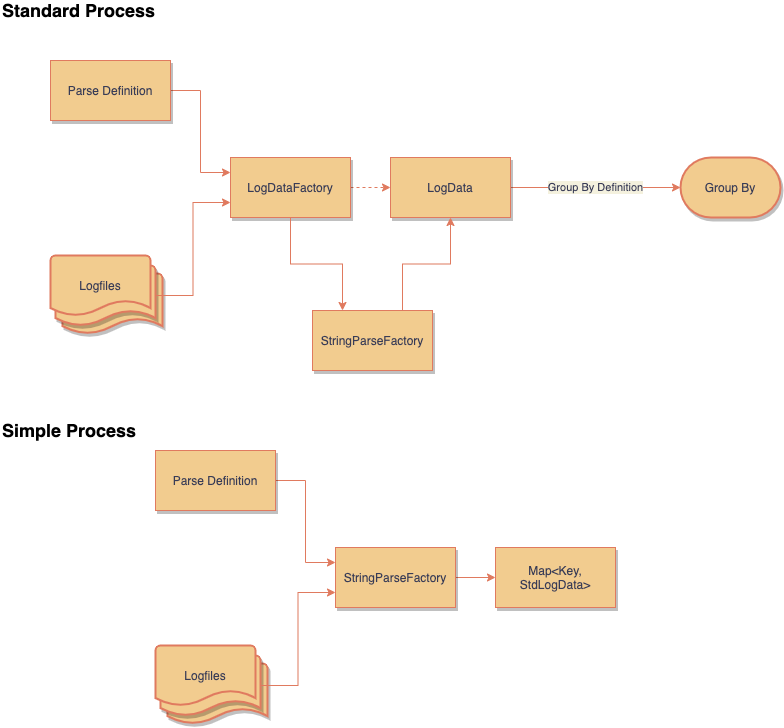
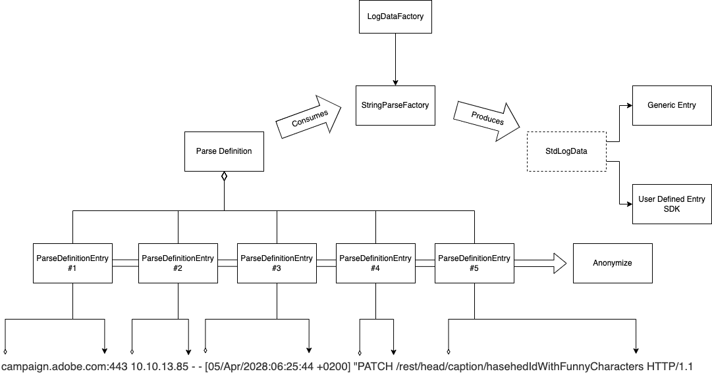
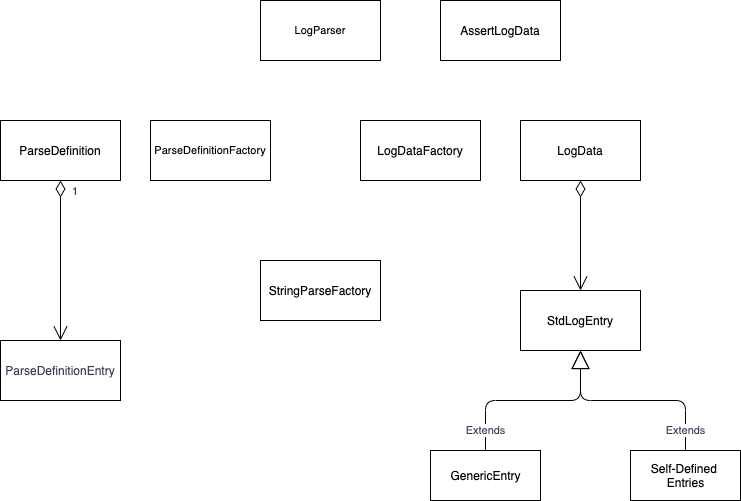

# log-parser
[](https://github.com/adobe/log-parser/actions/workflows/onPushSimpleTest.yml) 
[](https://codecov.io/gh/adobe/log-parser)

This project was created to allow us to parse and analyze log files in order to gather relevant data. It can be used as is or as an SDK. Where you can define your own parsing.

The basic method for using this library is, that you create a definition for your parsing. This definition allows you to parse a set of log files and extract all entries that match this pattern.




## Parse Definitions
In order to parse logs you need to define a ParseDefinition. A ParseDefinition contains a set of ordered ParseDefinition Entries. While parsing a line of logs, the LogParser will see if all entries can be found in the line of logs. If that is the case, the line is stored according to the definitions.

### Defining a Parsing
Each Parse Definition consists of :
- Title
- A set of entries
- A Padding allowing us to create a legible key
- A key Order which is used for defining the Key

### Defining an entry
Each entry for a Parse Definition allows us to define:
- A title for the value which will be found.
- The start pattern of the string that will contain the value (null if in the start of a line)
- The end pattern of the string that will contain the value (null if in the end of a line)
- Case Sensitive search
- Is to be kept. In some cases we just need to find a line with certain particularities, but we don't actually want to store the value.

### How parsing works
When you have defined your parsing you use the LogDataFactory by passing it:
1. The log files it should parse
2. The ParseDefinition

By using the StringParseFactory we get a LogData object with allows us to manage the logs data you have found.



### Import and Export
You can import or store a Parse Definition to or from a JSON file.

## Using the Standard Method
By default each entry for your lag parsing will be stored as a Generic entry. This means that all values will be stored as Strings. Each entry will have a :
- Key
- A set of values
- The frequence of the key as found in the logs

## Using the SDK
Using the log parser as an SDK allow you to define your own transformations and also to override many of the behaviors.

In order to use this feature you need to define a class that extends the class StdLogEntry

## Code Structure
Below is a diagram representing the class structure:



## Searching a organizing log data
As of versions 1.0.4 & 1.0.5 we have a series of search and organizing the log data.

### Search and Filter Mechanisms
We have introduced the filter and search mechanisms. These allow you to search the LogData for values for a given ParseDefinitionEntry. For this we have introduced the following methods:
* isElementPresent
* searchEntries
* filterBy

We currently have the following signatures:

```java
public boolean isEntryPresent(String in_parseDefinitionName, String in_searchValue)
public boolean isEntryPresent(Map<String, Object> in_searchKeyValues)
public LogData<T> searchEntries(String in_parseDefinitionName, String in_searchValue)
public LogData<T> searchEntries(Map<String, Object> in_searchKeyValues)
public LogData<T> filterBy(Map<String, Object> in_filterKeyValues)
```

In the cases where the method accepts a map we allow the user to search by a series of search terms. Example:

```java
Map<String, Object> l_filterProperties = new HashMap<>();
        l_filterProperties.put("Definition 1", "14");
        l_filterProperties.put("Definition 2", "13");

LogData<GenericEntry> l_foundEntries = l_logData.searchEntries(l_filterProperties)); 
```

### GroupBy Mechanisms
We have introduced the groupBy mechanism. This functionality allows you to organize your results with more detail. Given a log data object, and an array of ParseDefinitionEntry names, we generate a new LogData Object containing groups made by the passed ParseDeinitionEnries and and number of entries for each group.

Let's take the following case:

Definition 1 | Definition 2 | Definition 3 | Definition 4
------------ | ------------ | ------------ | ------------
12 | 14 | 13 | AA
112 | 114 | 113 | AAA
120 | 14 | 13 | AA


If we perform groupBy with the parseDefinition `Definition 2`, we will be getting a new LogData object with two entries:

Definition 2 | Frequence
------------ | ------------
14 | 2
114 | 1

We can also pass a list of group by items, or even perform a chaining of the group by predicates.

#### Passing a list
We can create a sub group of the LogData by creating group by function:

```java
LogData<GenericEntry> l_myGroupedData = logData.groupBy(Arrays.asList("Definition 1", "Definition 4"));

//or 

LogData<MyImplementationOfStdLogEntry> l_myGroupedData = logData.groupBy(Arrays.asList("Definition 1", "Definition 4"), MyImplementationOfStdLogEntry.class);
```

In this case we get :

Definition 1 | Definition 4 | Frequence
------------ | ------------ | ------------ 
12 | AA | 1
112 | AAA | 1
120 | AA | 1


#### Chaining GroupBy
The GroupBy can also be chained. Example:

```java
LogData<GenericEntry> l_myGroupedData = logData.groupBy(Arrays.asList("Definition 1", "Definition 4")).groupBy("Definition 4");
```

In this case we get :

Definition 4 | Frequence
------------ | ------------ 
AA | 2
AAA | 1

## Assertions and LogDataAssertions
As of version 1.0.5 we have introduced the notion of assertions. Assertions can either take a LogData object or a set of files as input.

We currently have the following assertions:

```java
AssertLogData.assertLogContains(LogData<T> in_logData, String in_entryTitle, String in_expectedValue)

AssertLogData.assertLogContains(List<String> in_filePathList, ParseDefinition in_parseDefinition, String in_entryTitle, String in_expectedValue)
```
`AssertLogData.assertLogContains(LogData<T>, String, String )` allows you to perform an assertion on an existing LogData Object. 


`AssertLogData.assertLogContains(List<String>, ParseDefinition, String, String)` allows you to perform an assertion directly on a file. 

## Release Notes
- 1.0.5
  - #23 Added the searchEntries, and the isEntryPresent methods.
  - #20 Adding log data assertions
  - keyOrder is now a List<String>
  - #32 we have solved an issue with exporting and importing the key orders
  - #30 Allowing for the LogDataFactory to accept a JSON file as input for the ParseDefinitions
  - #31 Solved bug with importing the JSON file
- 1.0.4
  - #6 We Can now import a definition from a JSON file. You can also export a ParseDefinition into a JSON file.
  - #8 & #18  Added the filter function.
  - #13 Added copy constructors.
  - #13 Added a copy method in the StdLogEntry (#13).
  - #14 Added a set method to LogData. This allows you to change a Log data given a key value and ParseDefinition entry title
  - Renamed exception IncorrectParseDefinitionTitleException to IncorrectParseDefinitionException.
  - 
- 1.0.3
  - Introduced the LogData Top Class. This encapsulates all results.
  - Introduced the LogDataFactory
  - Added the groupBy method to extract data from the results
- 1.0.1
  - Open source release.
